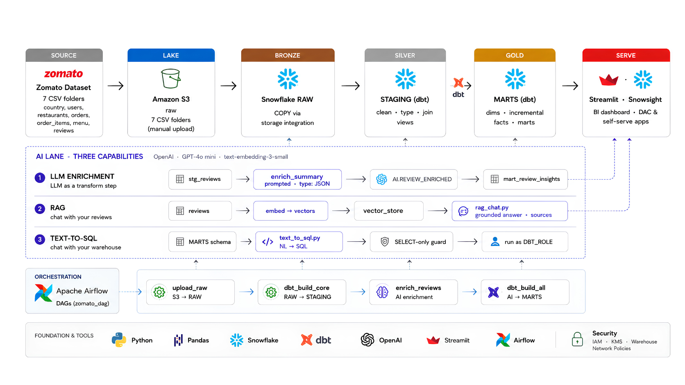

# Zomato AI Data Engineering — End-to-End Project

> 👨‍💻 **Project by:** Yashowardhan Sagar Shete

A complete batch data pipeline that takes Zomato-style food delivery data from raw CSVs all the way to AI-powered analytics:

**Zomato/Food Delivery Dataset → Amazon S3 → Snowflake → dbt → Airflow → AI (OpenAI)**

The dataset lands in an S3 data lake and flows into Snowflake through a storage integration, where dbt transforms it through medallion layers — RAW (Bronze) tables loaded via `COPY INTO`, cleaned STAGING (Silver) views, and business-ready MARTS (Gold) with dimensions, incremental facts, and aggregate marts. Apache Airflow orchestrates the whole pipeline as one daily DAG. On top of the warehouse sits an AI lane powered by OpenAI: LLM enrichment turns free-text reviews into structured, queryable columns; RAG lets you chat with your reviews; and text-to-SQL lets you query the warehouse in plain English. Streamlit serves the dashboards and AI apps.

## Architecture


📂 Dataset + project slides: Google Drive folder "https://drive.google.com/drive/project/1NUaaL5ID8Y-pUMgamX12GN73mIXBffUQ?usp=drive_link" — download the CSVs here and place them under data/ (they're too large to commit to the repo).
## What gets built

| **Layer**         | **Where**                  | **What** |
|-------------------|----------------------------|----------|
| **Source**        | `data/` (local)            | Zomato food delivery datasets |
| **Lake**          | Amazon S3                  | One bucket, `raw/<table>/` folder per CSV |
| **Bronze**        | Snowflake `ZOMATO.RAW`     | `COPY INTO` from S3 via a storage integration |
| **Silver**        | Snowflake `ZOMATO.STAGING` | dbt staging views — clean, type, rename every source |
| **Gold**          | Snowflake `ZOMATO.MARTS`   | Dimensions, incremental facts, business marts |
| **AI**            | Snowflake `ZOMATO.AI`      | LLM-enriched reviews, RAG chat, text-to-SQL |
| **Orchestration** | Airflow (Docker)           | One daily DAG: load → transform → enrich → AI mart |

## Tech stack

Python · Pandas · Amazon S3 · Snowflake · dbt (dbt-snowflake) · Apache Airflow · OpenAI · Streamlit · Power BI · Docker · Git

## Repository structure

```text
├── airflow/                  # Airflow on Docker
│   ├── Dockerfile
│   ├── docker-compose.yml
│   └── dags/
│       └── zomato_batch.py
├── zomato/                   # dbt project
│   ├── models/staging/       # Staging views + sources + tests
│   ├── models/marts/         # Dimensions, facts and business marts
│   └── macros/               # Custom schema-name macro
├── ai/                       # AI layer
│   ├── enrich_reviews.py     # LLM review enrichment
│   ├── rag_chat.py           # RAG — chat with your reviews
│   └── text_to_sql.py        # Text-to-SQL — chat with your warehouse
├── data/                     # Dataset files
└── .gitignore
```

> `data/`, logs, generated files, credentials, and dbt `target/` artifacts are intentionally not committed to the repository.

## How the pipeline works

### 1 · Data lands in S3

The Zomato datasets are uploaded to:

```text
s3://<BUCKET>/raw/<table>/
```

One folder is used for each table:

```text
restaurants/
users/
food/
menu/
orders/
order_items/
reviews/
```

### 2 · S3 → Snowflake: one keyless handshake

Snowflake reads the bucket using a storage integration and IAM role.

The data is loaded into the `ZOMATO.RAW` schema using `COPY INTO`.

### 3 · Transform — dbt (medallion)

- **Staging (Silver)** — cleans and standardizes the source data.
- **Dimensions (Gold)** — `dim_restaurants`, `dim_customer`, `dim_food`, and `dim_date`.
- **Facts (Gold)** — `fct_orders` and `fact_order_items`.
- **Marts (Gold)** — daily city revenue, restaurant performance, delivery SLA and review insights.
- **Tests** — `unique`, `not_null`, `relationships`, and `accepted_values`.

### 4 · Orchestrate — Airflow

One daily DAG runs the complete pipeline:

```text
reload_raw → dbt_build_core → enrich_reviews → dbt_build_ai
```

```text
(COPY from S3) → (dbt build + tests) → (OpenAI enrichment) → (AI mart)
```

Credentials are kept outside the code using environment variables.

### 5 · AI layer — three capabilities

1. **LLM enrichment** (`ai/enrich_reviews.py`) — uses OpenAI to analyze reviews and create structured sentiment, topic and key-issue information.

2. **RAG** (`ai/rag_chat.py`) — lets users chat with their reviews by retrieving relevant reviews and generating answers grounded in the review data.

3. **Text-to-SQL** (`ai/text_to_sql.py`) — lets users ask questions about the warehouse in plain English and generates SELECT-only Snowflake SQL.

### 6 · Analytics

Power BI can connect to the Snowflake MARTS layer for dashboards covering:

- Revenue and GMV
- Orders
- AOV
- Cancellation rate
- Restaurant performance
- Delivery SLA
- Customer reviews
- Sentiment analysis

## Running it

```bash
# dbt
cd zomato
dbt debug
dbt build --exclude tag:ai

# Airflow
cd airflow
docker compose build
docker compose up -d

# AI applications
streamlit run ai/rag_chat.py
streamlit run ai/text_to_sql.py
```

## Author

**Yashowardhan Sagar Shete**

B.Tech — Computer Science / AI Specialization  
MIT-ADT University, Pune

GitHub: https://github.com/yashowardhan0124
